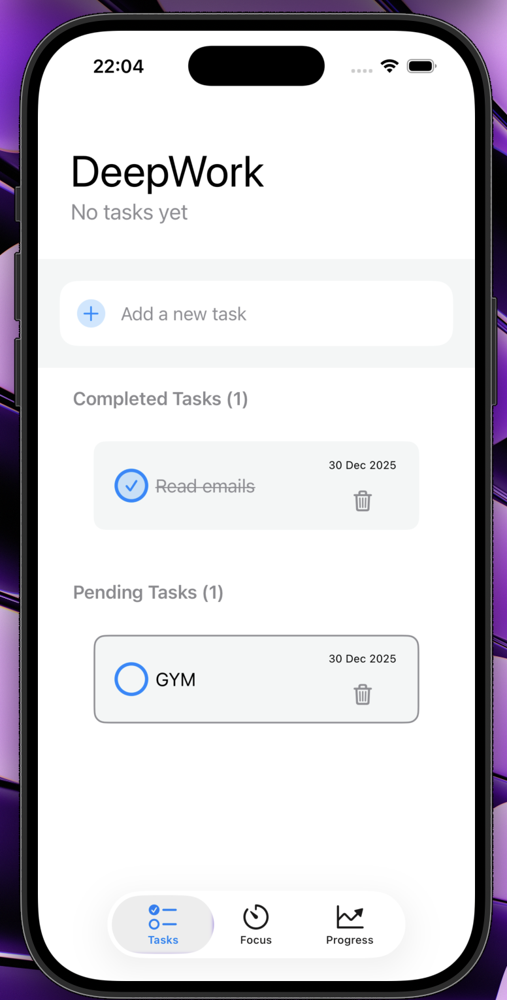
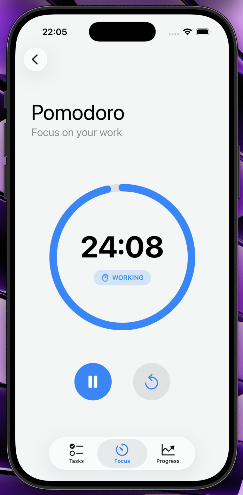
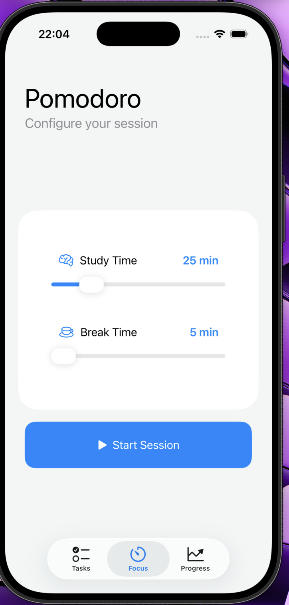
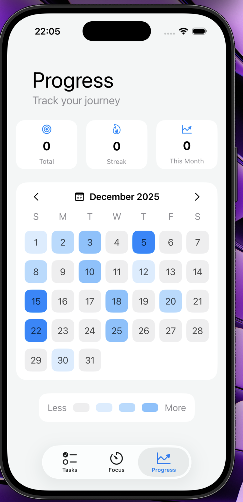

# 🧠 DeepFocus

**DeepFocus** is an iOS app focused on **productivity and concentration**, combining a **task manager**, a **Pomodoro timer**, and a **visual progress dashboard**.  
It is a personal project built to practice **SwiftUI**, animations, state management, and modern UI design.

---

## ✨ Features

### 📝 Task Manager
- Quickly create tasks
- Mark tasks as completed or pending
- Clean and minimal interface

### ⏱ Pomodoro Timer
- Configurable study and break durations
- Automatic switch between **WORKING** and **RESTING**
- Animated circular progress indicator
- Play, pause, and reset controls
- UI inspired by real productivity apps

### 📊 Progress View
- General statistics (mock data)
- Monthly calendar heatmap
- Daily activity visualization
- Clean and modern design

---

## 📱 Screenshots

### 📝 Tasks View

### ⏱ Focus / Pomodoro View

### 📅 Progress / Calendar View

---

## 🎥 Demo Video

A full demo of the app is available here:
[▶️ Watch Demo Video](Demo.mov)

The video showcases:
- Navigation between tabs
- Pomodoro timer usage
- Animations and state transitions
- Progress and calendar view

---

## 🛠 Tech Stack

## 🛠 Tech Stack

- **Swift**
- **SwiftUI**
- **SwiftData** (local persistence)
- **Combine** (Timer)
- **Xcode**
- Architecture based on `View + State`

---

## 🎯 Project Purpose

This project was created to:

- Learn and practice **advanced SwiftUI**
- Work with timers and animations
- Design an app with **realistic UX**
- Simulate an App Store–ready application from a UI/UX perspective

---

## 🚀 Possible Future Improvements

- Real data persistence (SwiftData)
- Real statistics in the Progress view
- Notifications when Pomodoro cycles finish
- Sounds and haptic feedback
- Dedicated dark mode
- iCloud synchronization

---

## 👨‍💻 Author

**Alejandro Alonso**  
Personal learning and practice project in iOS development.